# Projeto Final

# Estrutura de Arquivos e Pastas

~~~
├── README.md  <- arquivo com o relatório do projeto
│
├── images     <- arquivos de imagens usadas no documento
│
└── resources  <- outros recursos (se houver)
~~~

# Relatório do Projeto

# Projeto `Marketplace - Equipe 7`

# Equipe
* `Felipe Iada Tomitar Vilar`
* `Filipe Seidi Ishida Veronezi`
* `Jeferson Luis Michelan`
* `Juliana Fernandes`
* `Letícia Ruttiman`

# Nível 1

## Diagrama Geral do Nível 1

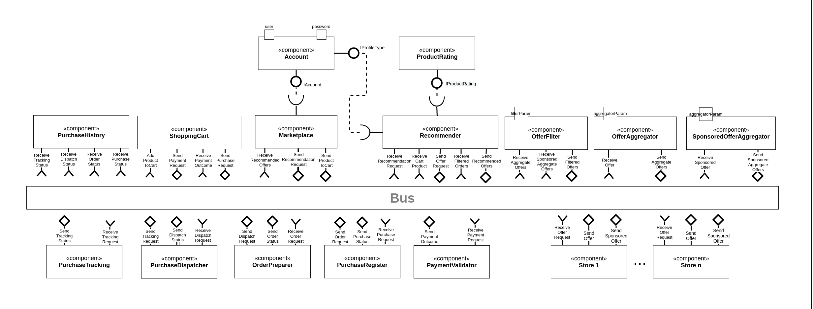

### Detalhamento da interação de componentes

* O componente `Account` recebe os atributos `user` e `password` para realizar a autenticação do usuário com sua conta no `Marketplace`.

* O componente `Marketplace` interage com `Account` através da interface `IAccount` para a autenticação do usuário. Esse componente também inicia o Processo de Lançamento e Distribuição de Ofertas, publicando no barramento a mensagem de tópico "`recommend/{userId}/request`" através da interface `SendRecommendationRequest`. Ao fim do processo, é recebida a mensagem "`offer/{userId}/recommended`", de interface `ReceiveRecommendedOffers`, com a lista de ofertas disponíveis para o usuário.
Caso o usuário decida realizar a compra de um produto, ao adicionar este produto ao carrinho, o componente Marketplace publica uma mensagem de tópico "`cart/{userId}/add`" através da interface `SendProductToCart`.

* O componente `Recommender` recebe uma mensagem "`recommend/{userId}/request`" da interface `ReceiveRecommendationRequest`, que inicia o Processo de Lançamento e Distribuição de Ofertas. Assim, ele publica a mensagem da interface `SendOfferRequest` e aguarda o resultado filtrado em `ReceiveFilteredOffers`. Através da interface `IProductRating`, o componente ordena as ofertas conforme as melhores avaliações e  publica a lista de ofertas na mensagem da interface `SendRecommendedOffers`. Com a mensagem da interface `ReceivePurchaseRequest`, este componente recebe dados da compra realizada pelo usuário e os utiliza no aprendizado de máquina, para melhorar seu algoritmo de recomendação de produtos conforme o perfil do usuário.

* O componente `ProductRating` faz o ranking dos produtos por loja, que é utilizado pelo componente `Recommender`. Nesse componente colocamos todas as regras desejadas pelo `Marketplace`, sendo que o ranking é realizado sempre pelo critério de produto/loja e sua nota, listando pelas notas em forma decrescente. A lista é retornada pela interface provida `IProductRating` ao componente `Recommender`.

* O componente `Store` representa cada loja do `Marketplace`. Cada loja pode participar do Processo de Lançamento e Distribuição de Ofertas ao receber a mensagem do tópico da interface `ReceiveOfferRequest`. Para participar, a loja deve publicar a mensagem com a sua oferta, sendo a mensagem da interface `SendSponsoredOffer` para oferta patrocinada e `SendOffer` para oferta comum.

* O componente `OfferAggregator` recebe as mensagens de ofertas através da interface `ReceiveOffer` e as agrega em uma lista que é publicada com a interface `SendAggregateOrders`.

* O componente `SponsoredOfferAggregator` realiza o mesmo processo que o `OfferAggregator`, mas somente para as ofertas patrocinadas.

* O `OfferFilter` recebe as listas de ofertas através das interfaces `ReceiveAggregateOffers` e `ReceiveSponsoredAggregateOffers` e as filtra conforme os critérios do Processo de Lançamento e Distribuição de Ofertas. Após filtrada, a lista de ofertas é publicada na interface `SendFilteredOffers`. 

* O `ShoppingCart` recebe através da interface `AddProductToCart` os produtos que o usuário deseja incluir no carrinho. Através da interface `SendPurchaseRequest`, é publicada a mensagem de solicitação de compra dos produtos do carrinho. A solicitação de pagamento dos produtos que estão no carrinho é realizada através da publicação da mensagem da interface `SendPaymentRequest`, que aguarda uma resposta na mensagem da interface `ReceivePaymentOutcome`.

## Componente `Account`

> Este componente realiza a autenticação do usuário.

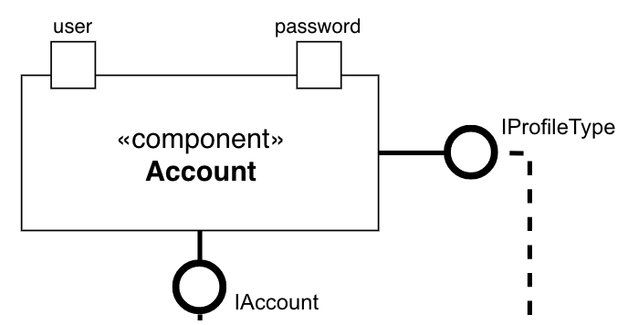

**Interfaces**
> IAccount

> IProfileType

## Componente `Marketplace`

> Este componente é responsável pelos fluxos principais do sistema de Marketplace.

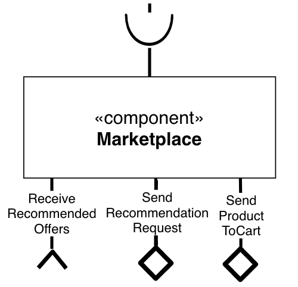

**Interfaces**
> SendProductToCart

> SendRecommendationRequest

> ReceiveRecommendedOffers

## Detalhamento das Interfaces

### Interface `SendProductToCart`

> É responsável por enviar um novo produto escolhido pelo usuário para seu carrinho de compra.

Dados da interface:
* Type: `source`
* Topic: `cart/{userId}/add`
* Message type: `AddProduct`

Esquema das mensagens JSON:
~~~json
{
    userId: string,
    productId: string,
    storeId: string,
    quantity: number
}
~~~

### Interface `SendRecommendationRequest`

> É responsável por enviar uma requisição de recomendação de produtos.

Dados da interface:
* Type: `source`
* Topic: `recommend/{userId}/request`
* Message type: `RecommendationRequest`

Esquema das mensagens JSON:
~~~json
{
    userId: string,
    category: string,
    deadlineSec: number
}
~~~

### Interface `ReceiveRecommendedOffers`

> É responsável por receber a lista de produtos recomendados.

Dados da interface:
* Type: `sink`
* Topic: `offer/{userId}/recommended`
* Message type: `RecommendedOffer`

Esquema das mensagens JSON:
~~~json
{
    offerId: string,
    offers: [
        {
            storeId: string,
            productId: string,
            price: number
        }
    ]
}
~~~

## Componente `ShoppingCart`

> Este componente é responsável pelo carrinho de compra.

**Interfaces**
> AddProductToCart

> SendPaymentRequest

> ReceivePaymentOutcome

> SendPurchaseRequest

### Interface `AddProductToCart`

> É responsável por receber um novo produto escolhido pelo usuário para seu carrinho de compra.

Dados da interface:
* Type: `sink`
* Topic: `cart/{userId}/add`
* Message type: `AddProduct`

Esquema das mensagens JSON:
~~~json
{
    userId: string,
    productId: string,
    storeId: string,
    quantity: number
}
~~~

### Interface `SendPaymentRequest`

> É responsável por enviar a solicitação de pagamento da compra.

Dados da interface:
* Type: `source`
* Topic: `payment/{orderId}/request`
* Message type: `PaymentRequest`

Esquema das mensagens JSON:
~~~json
{
    orderId: string,
    amount: number
    paymentMethod: string
}
~~~

### Interface `ReceivePaymentOutcome`

> É responsável por receber o resultado da solicitação de pagamento da compra.

Dados da interface:
* Type: `sink`
* Topic: `payment/{orderId}/outcome`
* Message type: `PaymentOutcome`

Esquema das mensagens JSON:
~~~json
{
    orderId: string,
    outcome: string
}
~~~

### Interface `SendPurchaseRequest`

> É responsável por enviar a solicitação de registro da efetivação da compra.

Dados da interface:
* Type: `source`
* Topic: `purchase/{orderId}/request`
* Message type: `PurchaseRequest`

Esquema das mensagens JSON:
~~~json
{
    address:{
      address:string,
      zipcode:string,
      state:string,
      city:string
    },
    products:[
      {
          storeId:string,
          productId:string,
          price:number
      }
    ],
    paymentMethod:{
      type:string,
      value:string,
      paymentInfo:{
          installment:boolean         
      }
    },
    discountCoupon:string
}
~~~

## Componente `PaymentValidator`

> Este componente é responsável por realizar o pagamento da compra.

**Interfaces**
> ReceivePaymentRequest

> SendPaymentOutcome

### Interface `ReceivePaymentRequest`

> É responsável por receber a solicitação de pagamento da compra.

Dados da interface:
* Type: `sink`
* Topic: `payment/{orderId}/request`
* Message type: `PaymentRequest`

Esquema das mensagens JSON:
~~~json
{
    orderId: string,
    amount: number
    paymentMethod: string
}
~~~

### Interface `SendPaymentOutcome`

> É responsável por enviar o resultado do pagamento da compra.

Dados da interface:
* Type: `source`
* Topic: `payment/{orderId}/outcome`
* Message type: `PaymentOutcome`

Esquema das mensagens JSON:
~~~json
{
    orderId: string,
    outcome: string
}
~~~

## Componente `PurchaseRegister`

> Este componente é responsável por registrar a compra efetuada.

**Interfaces**
> ReceivePurchaseRequest

> SendPurchaseStatus

> SendOrderRequest

### Interface `ReceivePurchaseRequest`

> É responsável por receber a solicitação de registro da efetivação da compra.

Dados da interface:
* Type: `sink`
* Topic: `purchase/{orderId}/request`
* Message type: `PurchaseRequest`

Esquema das mensagens JSON:
~~~json
{
    address:{
      address:string,
      zipcode:string,
      state:string,
      city:string
    },
    products:[
      {
          storeId:string,
          productId:string,
          price:number
      }
    ],
    paymentMethod:{
      type:string,
      value:string,
      paymentInfo:{
          installment:boolean         
      }
    },
    discountCoupon:string
}
~~~

### Interface `SendPurchaseStatus`

> É responsável por enviar o status da compra efetivada.

Dados da interface:
* Type: `source`
* Topic: `purchase/{orderId}/status`
* Message type: `PurchaseStatus`

Esquema das mensagens JSON:
~~~json
{
    orderId: string,
    status: string
}
~~~

### Interface `SendOrderRequest`

> É responsável por enviar a requisição de encomenda.

Dados da interface:
* Type: `source`
* Topic: `order/{orderId}/request`
* Message type: `OrderRequest`

Esquema das mensagens JSON:
~~~json
{
    orderId: string,
    address:{
      address:string,
      zipcode:string,
      state:string,
      city:string
    },
    products:[
      {
          storeId:string,
          productId:string
      }
    ]
}
~~~

## Componente `OrderPreparer`

> Este componente é responsável por preparar a encomenda para o envio.

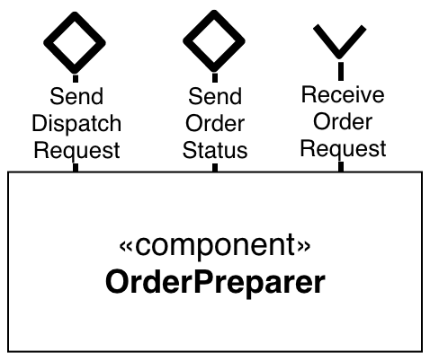

**Interfaces**
> ReceiveOrderRequest

> SendOrderStatus

> SendDispatchRequest

### Interface `ReceiveOrderRequest`

> É responsável por receber a requisição de encomenda.

Dados da interface:
* Type: `sink`
* Topic: `order/{orderId}/request`
* Message type: `OrderRequest`

Esquema das mensagens JSON:
~~~json
{
    orderId: string,
    address:{
      address:string,
      zipcode:string,
      state:string,
      city:string
    },
    products:[
      {
          storeId:string,
          productId:string
      }
    ]
}
~~~

### Interface `SendOrderStatus`

> É responsável por enviar o status da encomenda.

Dados da interface:
* Type: `source`
* Topic: `order/{orderId}/status`
* Message type: `OrderStatus`

Esquema das mensagens JSON:
~~~json
{
    orderId: string,
    status: string
}
~~~

### Interface `SendDispatchRequest`

> É responsável por enviar a requisição de despacho.

Dados da interface:
* Type: `source`
* Topic: `dispatch/{orderId}/request`
* Message type: `DispatchRequest`

Esquema das mensagens JSON:
~~~json
{
    orderId: string,
    address:{
      address:string,
      zipcode:string,
      state:string,
      city:string
    }
}
~~~

## Componente `PurchaseDispatcher`

> Este componente é responsável por realizar o despacho da encomenda.

**Interfaces**
> ReceiveDispatchRequest

> SendDispatchStatus

> SendTrackingRequest

### Interface `ReceiveDispatchRequest`

> É responsável por receber a requisição de despacho.

Dados da interface:
* Type: `sink`
* Topic: `dispatch/{orderId}/request`
* Message type: `DispatchRequest`

Esquema das mensagens JSON:
~~~json
{
    orderId: string,
    address:{
      address:string,
      zipcode:string,
      state:string,
      city:string
    }
}
~~~

### Interface `SendDispatchStatus`

> É responsável por enviar o status do despacho.

Dados da interface:
* Type: `source`
* Topic: `dispatch/{orderId}/status`
* Message type: `DispatchStatus`

Esquema das mensagens JSON:
~~~json
{
    orderId: string,
    status: string
}
~~~

### Interface `SendTrackingRequest`

> É responsável por enviar a requisição de rastreio.

Dados da interface:
* Type: `source`
* Topic: `tracking/{orderId}/request`
* Message type: `TrackingRequest`

Esquema das mensagens JSON:
~~~json
{
    orderId: string
}
~~~

## Componente `PurchaseTracking`

> Este componente é responsável por realizar o rastreio da encomenda.

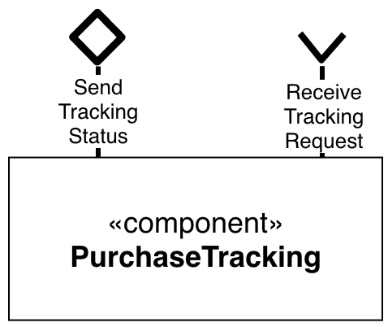

**Interfaces**
> ReceiveTrackingRequest

> SendTrackingStatus

### Interface `ReceiveTrackingRequest`

> É responsável por enviar a requisição de rastreio.

Dados da interface:
* Type: `sink`
* Topic: `tracking/{orderId}/request`
* Message type: `TrackingRequest`

Esquema das mensagens JSON:
~~~json
{
    orderId: string
}
~~~

### Interface `SendTrackingStatus`

> É responsável por enviar o status do rastreio.

Dados da interface:
* Type: `source`
* Topic: `tracking/{orderId}/status`
* Message type: `TrackingStatus`

Esquema das mensagens JSON:
~~~json
{
    orderId: string,
    status: string
}
~~~

## Componente `PurchaseHistory`

> Este componente é responsável pelo progresso no processo de envio da encomenda.

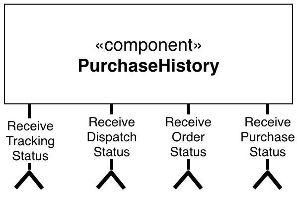

**Interfaces**
> ReceivePurchaseStatus

> ReceiveOrderStatus

> ReceiveDispatchStatus

> ReceiveTrackingStatus

### Interface `ReceivePurchaseStatus`

> É responsável por receber o status de efetivação da compra.

Dados da interface:
* Type: `sink`
* Topic: `purchase/{orderId}/status`
* Message type: `PurchaseStatus`

Esquema das mensagens JSON:
~~~json
{
    orderId: string,
    status: string
}
~~~

### Interface `ReceiveOrderStatus`

> É responsável por receber o status da encomenda.

Dados da interface:
* Type: `sink`
* Topic: `order/{orderId}/status`
* Message type: `OrderStatus`

Esquema das mensagens JSON:
~~~json
{
    orderId: string,
    status: string
}
~~~

### Interface `ReceiveDispatchStatus`

> É responsável por receber o status do despacho.

Dados da interface:
* Type: `sink`
* Topic: `dispatch/{orderId}/status`
* Message type: `DispatchStatus`

Esquema das mensagens JSON:
~~~json
{
    orderId: string,
    status: string
}
~~~

### Interface `ReceiveTrackingStatus`

> É responsável por receber o status do rastreio.

Dados da interface:
* Type: `sink`
* Topic: `tracking/{orderId}/status`
* Message type: `TrackingStatus`

Esquema das mensagens JSON:
~~~json
{
    orderId: string,
    status: string
}
~~~

## Componente `ProductRating`

> Este componente é responsável por ordenar os produtos conforme as notas das avaliações, dos melhores para os piores avaliados.

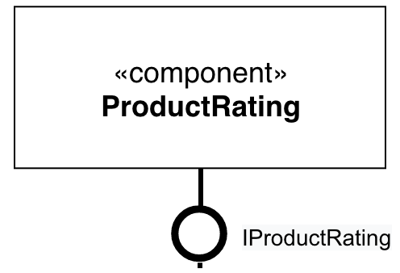

**Interfaces**
> IProductRating

## Componente `Recommender`

> Este componente é responsável por produzir a lista de produtos recomendados para o usuário.

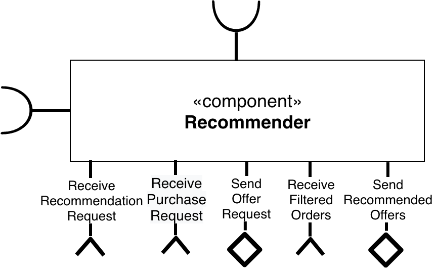

**Interfaces**
> ReceiveRecommendationRequest

> ReceivePurchaseRequest

> SendOfferRequest

> ReceiveFilteredOffers

> SendRecommendedOffers

### Interface `ReceiveRecommendationRequest`

> É responsável por receber a requisição da lista de recomendações.

Dados da interface:
* Type: `sink`
* Topic: `recommend/{userId}/request`
* Message type: `RecommendationRequest`

Esquema das mensagens JSON:
~~~json
{
    userId: string,
    category: string,
    deadlineSec: number
}
~~~

### Interface `ReceivePurchaseRequest`

> É responsável por receber a requisição de compra para realizar o aprendizado de máquina com os dados de compra do usuário.

Dados da interface:
* Type: `sink`
* Topic: `purchase/{orderId}/request`
* Message type: `PurchaseRequest`

Esquema das mensagens JSON:
~~~json
{
   address:{
      address:string,
      zipcode:string,
      state:string,
      city:string
   },
   products:[
      {
         storeId:string,
         productId:string,
         price:number
      }
   ],
   paymentMethod:{
      type:string,
      value:string,
      paymentInfo:{
         installment:boolean         
      }
   },
   discountCoupon:string
}
~~~

### Interface `SendOfferRequest`

> É responsável por enviar a requisição da lista de ofertas.

Dados da interface:
* Type: `source`
* Topic: `offer/{userId}/request`
* Message type: `OfferRequest`

Esquema das mensagens JSON:
~~~json
{
    userId: string,
    offerId: string,
    category: string
}
~~~

### Interface `ReceiveFilteredOffers`

> É responsável por receber a lista de ofertas filtrada.

Dados da interface:
* Type: `sink`
* Topic: `offer/{userId}/filtered`
* Message type: `FilteredOffer`

Esquema das mensagens JSON:
~~~json
{
    offerId: string,
    offers: [
        {
            storeId: string,
            productId: string,
            price: number
        }
    ]
}
~~~

### Interface `SendRecommendedOffers`

> É responsável por enviar a lista de ofertas recomendadas.

Dados da interface:
* Type: `source`
* Topic: `offer/{userId}/request`
* Message type: `OfferRequest`

Esquema das mensagens JSON:
~~~json
{
    offerId: string,
    offers: [
        {
            storeId: string,
            productId: string,
            price: number
        }
    ]
}
~~~

## Componente `Store`

> Este componente representa cada loja do Marketplace.

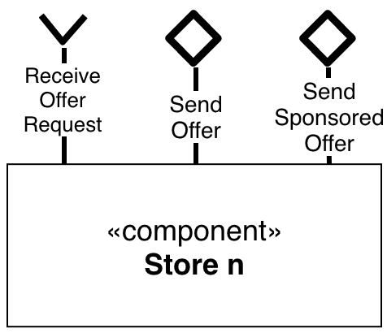

**Interfaces**
> ReceiveOfferRequest

> SendOffer

> SendSponsoredOffer

### Interface `ReceiveOfferRequest`

> É responsável por recebr a requisição da lista de ofertas.

Dados da interface:
* Type: `sink`
* Topic: `offer/{userId}/request`
* Message type: `OfferRequest`

Esquema das mensagens JSON:
~~~json
{
    userId: string,
    offerId: string,
    category: string
}
~~~

### Interface `SendOffer`

> É responsável por enviar uma oferta comum.

Dados da interface:
* Type: `source`
* Topic: `offer/{userId}/offer/common`
* Message type: `Offer`

Esquema das mensagens JSON:
~~~json
{
    offerId: string,
    storeId: string,
    productId: string,
    price: number
}
~~~

### Interface `SendSponsoredOffer`

> É responsável por enviar uma oferta patrocinada.

Dados da interface:
* Type: `source`
* Topic: `offer/{userId}/offer/sponsored`
* Message type: `SponsoredOffer`

Esquema das mensagens JSON:
~~~json
{
    offerId: string,
    storeId: string,
    productId: string,
    price: number
}
~~~

## Componente `OfferAggregator`

> Este componente é responsável por agregar as ofertas recebidas.

**Interfaces**
> ReceiveOffer

> SendAggregateOffers

### Interface `ReceiveOffer`

> É responsável por receber uma oferta comum.

Dados da interface:
* Type: `sink`
* Topic: `offer/{userId}/offer/common`
* Message type: `Offer`

Esquema das mensagens JSON:
~~~json
{
    offerId: string,
    storeId: string,
    productId: string,
    price: number
}
~~~

### Interface `SendAggregateOffers`

> É responsável por enviar a lista de ofertas comuns.

Dados da interface:
* Type: `source`
* Topic: `offer/{userId}/aggregate/common`
* Message type: `AggregateOffer`

Esquema das mensagens JSON:
~~~json
{
    offerId: string,
    offers: [
        {
            storeId: string,
            productId: string,
            price: number
        }
    ]
}
~~~

## Componente `SponsoredOfferAggregator`

> Este componente é responsável por agregar as ofertas patrocinadas recebidas.

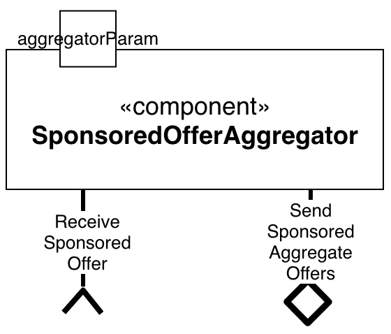

**Interfaces**
> ReceiveSponsoredOffer

> SendSponsoredAggregateOffers

### Interface `ReceiveSponsoredOffer`

> É responsável por receber uma oferta patrocinada.

Dados da interface:
* Type: `sink`
* Topic: `offer/{userId}/offer/sponsored`
* Message type: `SponsoredOffer`

Esquema das mensagens JSON:
~~~json
{
    offerId: string,
    storeId: string,
    productId: string,
    price: number
}
~~~

### Interface `SendSponsoredAggregateOffers`

> É responsável por enviar a lista de ofertas patrocinadas.

Dados da interface:
* Type: `source`
* Topic: `offer/{userId}/aggregate/sponsored`
* Message type: `SponsoredAggregateOffer`

Esquema das mensagens JSON:
~~~json
{
    offerId: string,
    offers: [
        {
            storeId: string,
            productId: string,
            price: number
        }
    ]
}
~~~

## Componente `OfferFilter`

> Este componente é responsável por filtrar as ofertas agregadas.

**Interfaces**
> ReceiveAggregateOffers

> ReceiveSponsoredAggregateOffers

> SendFilteredOffers

### Interface `ReceiveAggregateOffers`

> É responsável por receber a lista de ofertas comuns.

Dados da interface:
* Type: `sink`
* Topic: `offer/{userId}/aggregate/common`
* Message type: `AggregateOffer`

Esquema das mensagens JSON:
~~~json
{
    offerId: string,
    offers: [
        {
            storeId: string,
            productId: string,
            price: number
        }
    ]
}
~~~

### Interface `ReceiveSponsoredAggregateOffers`

> É responsável por receber a lista de ofertas patrocinadas.

Dados da interface:
* Type: `sink`
* Topic: `offer/{userId}/aggregate/sponsored`
* Message type: `SponsoredAggregateOffer`

Esquema das mensagens JSON:
~~~json
{
    offerId: string,
    offers: [
        {
            storeId: string,
            productId: string,
            price: number
        }
    ]
}
~~~

### Interface `SendFilteredOffers`

> É responsável por enviar a lista consolidada de ofertas após serem filtradas.

Dados da interface:
* Type: `source`
* Topic: `offer/{userId}/filtered`
* Message type: `FilteredOffer`

Esquema das mensagens JSON:
~~~json
{
    offerId: string,
    offers: [
        {
            storeId: string,
            productId: string,
            price: number
        }
    ]
}
~~~

# Nível 2

> Apresente aqui o detalhamento do Nível 2 conforme detalhado na especificação com, no mínimo, as seguintes subseções:

## Diagrama do Nível 2

> Apresente um diagrama conforme o modelo a seguir:

> 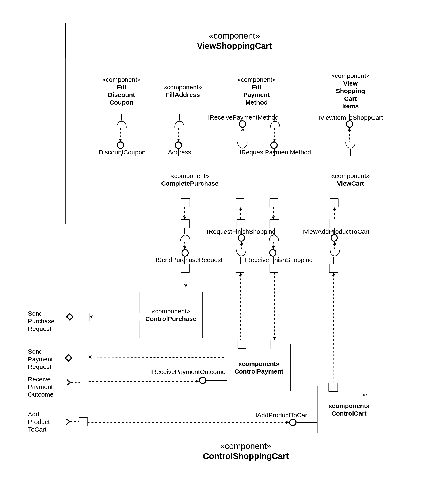

### Detalhamento da interação de componentes

* Adição de produtos no carrinho

  - O componente `ControlShoppingCart` assina no barramento mensagens o tópico "`payment/{userId}/add`" por meio da interface `IAddProductToCart` e "`payment/{orderId}/outcome`" por meio da interface IreceivePaymentOutcome.

  - Ao receber uma mensagem `AddProduct` do tópico "`payment/{userId}/add"` , `ControlCart` dispara a adição de um produto no carrinho e solicita ao Model de ShoppingCart o carregamento das informações do produto, preço, quantidade, desconto aplicado e vendedor. Com a mudança no model de `ShoppingCart`, `ViewCart` é  notificado usando a interface `IViewAddProductToCart`.
  
  - `ViewCart` deve carregar o novo produto adicionado ao carrinho e suas informações. `ViewCart` exibe de forma resumida o produto adicionado e notifica `ViewShoppingCartItems` que deve exibir o novo produto adicionado com as informações detalhadas.

* Pagamento

  - Por meio de `FillAddress` e `FillDiscountCoupon`, o usuário preenche os dados de endereço e cupom de desconto. Essas informações são enviadas para o componente `CompletePurchase` que consolida as informações do pedido, usando as interfaces IDiscountCoupon e IAddress de `CompletePurchase`.

  - Quando o usuário completa as informações de pagamento do pedido, o componente `FillPaymentMethod` notifica `CompletePurchase`. Como o dado de pagamento deve ser validado, `CompletePurchase` notifica `ControlPayment` publica a mensagem `PaymentRequest`, com os dados de pagamento, no tópico "`payment/{orderId}/request`".

  - Quando o pagamento é validado, o componente ControlShoppingCart recebe a mensagem `ReceivePaymentOutcome` no tópico "`payment/{orderId}/outcome`" com os dados da validação do pagamento. `ControlPayment` notifica `FillPaymentMehod` por meio do componente `CompletePurchase` se o pagamento é valido ou não.

  - Se todos os dados forem preenchidos com sucesso e o pagamento foi validado, `CompletePurchase` notifica `ControlPurchase` o pedido foi concluído.

  - `ControlPurchase` por sua vez envia a mensagem `PurchaseRequest` via barramento no tópico "`purchase/{orderId}/request`", informando que a compra foi concluída e enviando o pedido para a próxima etapa de processamento.

## Componente `FillDiscountCoupon`

> Este componente provê uma interface gráfica para entrada do cupom de desconto.

## Componente `FillAddress`

> Este componente provê uma interface gráfica para entrada do endereço de destino da compra.

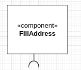

## Componente `FillPaymentMethod`

> Este componente provê uma interface gráfica para entrada do meio de pagamento da compra.

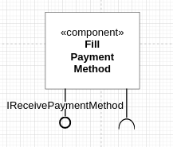

**Interfaces**

## Detalhamento das Interfaces

### Interface `IReceivePaymentMethod`

Método | Objetivo
-------| --------
`recvPaymentOutcome` | Recebe o status de validação do pagamento

## Componente `CompletePurchase`

> Consolida os dados da compra no marketplace para envio da compra.

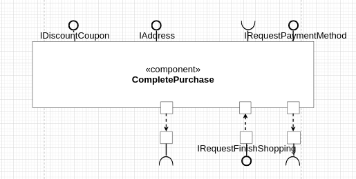

**Interfaces**

## Detalhamento das Interfaces

### Interface `IDiscountCoupon`

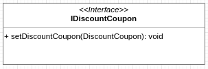

Método | Objetivo
-------| --------
`setDiscountCoupon(DiscountCoupon): void` | Recebe um objeto do tipo DiscountCoupon que possui os dados do cupom de desconto

### Interface `IAddress`

Método | Objetivo
-------| --------
`setAddress(Address): void` | Recebe um objeto do tipo Address que possui os dados de endereço para envio da compra

### Interface `IRequestPaymentMethod`

Método | Objetivo
-------| --------
`sendPaymentToValidade(PaymentRequest): void` | Recebe um objeto do tipo PaymentRequest para validação do método de compra

### Interface `IRequestFinishSopping`

Método | Objetivo
-------| --------
`recvFinishShopping(PaymentOutcome): void` | Recebe um objeto do tipo PaymentOutcome que indica que o status do pagamento do pedido

## Componente `ControlPurchase`

> Componente responsável por enviar a solicitação de efetivação da compra do pedido

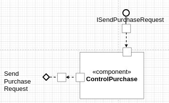

**Interfaces**

## Detalhamento das Interfaces

### Interface `ISendPurchaseRequest`

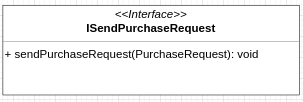

Método | Objetivo
-------| --------
`sendPurchaseRequest(PurchaseRequest): void` | Recebe um objeto do tipo PurchaseRequest para finalizar e enviar o pedido para a próxima etapa de processamento.

## Componente `ControlCart`

> Recebe as mensagens para adicionar o produto no carrinho.

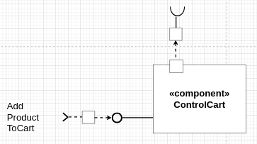

**Interfaces**

## Detalhamento das Interfaces

### Interface `IReceiveAddProduct`

Método | Objetivo
-------| --------
`recvAddProductToCart(AddProduct): void` | Recebe um objeto do tipo AddProduct que será adicionado ao carrinho de compras

## Componente `ViewShoppingCartItems`

> Componente para visualizar os itens do carrinho de maneira detalhada

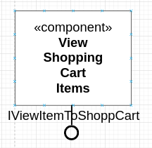

**Interfaces**

## Detalhamento das Interfaces

### Interface `IViewItemToShoppCart`

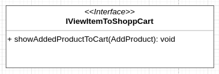

Método | Objetivo
-------| --------
`showAddedProductToCart(AddProduct): void` | Recebe um objeto do tipo AddProduct para exibí-lo de maneira detalhada

## Componente `ViewCart`

> Componente para visualizar os itens do carrinho de maneira resumida

**Interfaces**

## Detalhamento das Interfaces

### Interface `IViewAddProductToCart`

Método | Objetivo
-------| --------
`recvAddProductToCart(AddProduct): void` | Recebe um objeto do tipo AddProduct para exibí-lo de maneira resumida

## Diagrama do Nível 3

> Imagens com captura de tela do protótipo feito no MIT App Inventor:

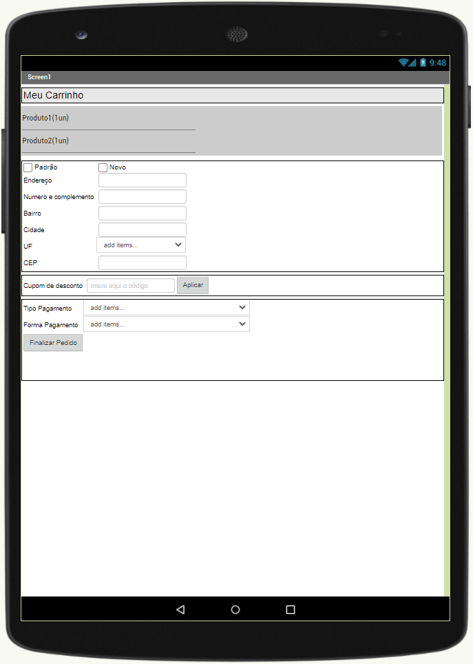

> Diagrama referente ao protótipo:

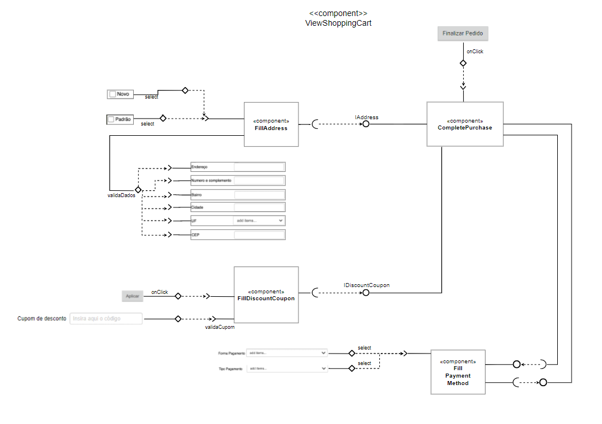

### Detalhamento da interação de componentes

- O componente `CompletePurchase` responde ao evento de clique no botão "Finalizar Pedido" e é dependente dos componentes `FillAddress`, `FillDiscountCoupon` e `FillPaymentMethod`;
- O componente `FillAddress` reage a seleção de uma entre duas opções: "Novo" e "Padrão":
  - "Novo": o componente deverá validar os novos dados de endereço preenchidos pelo usuário nos campos da interface;
  - "Padrão": o componente deverá preencher os campos da interface com o último endereço utilizado pelo usuário em compras recentes;
- O componente `FillDiscountCoupon` responde ao evento de clique no botão "Aplicar" e então verifica se os dados preenchidos no campo "Cupom de desconto" são validos como cupom de desconto;
- O componente `FillPaymentMethod` recebe as informações da seleção das caixas "Forma Pagamento" e "Tipo Pagamento" e então notifica o componente `CompletePurchase`. Como o dado de pagamento deve ser validado, `CompletePurchase` notifica `ControlPayment` publicando a mensagem `PaymentRequest`, com os dados de pagamento, no tópico "`payment/{orderId}/request`".
